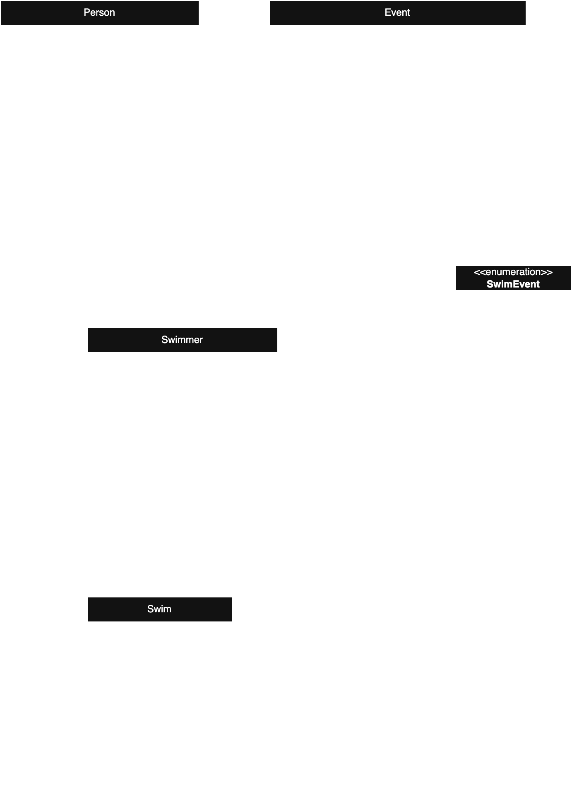

# ICS4U OOP Design Project

See instructions [here](INSTRUCTIONS.md) for details.

*UML DIAGRAM*
#### 

# Swimmer Mangement System / Swim Meet Manager 

## Summary

This project is a Swimmer Management System designed to track swimmers, their swim events, and their swimming history. 

The program calculates a swimmer's fastest swims, their potential to go professional, and organizes swimmers by events and times.

## Current Features
- Manage swimmers and their personal details (name, birth year, country, etc.).
- Track swimmers' fastest swims for various events.
- Sort swimmers' swim history from fastest to slowest.
- Create fully proper and detailed heatsheets given a list of swimmers
- Determine if a swimmer has the potential to go professional based on their best swim times and age.
- Currently fully implements swim events 100m and 200m freestyle

## Classes

### Person
A base class representing an individual with attributes such as first name, last name, gender, birth year, height, and country. It includes methods to retrieve these details and calculate the swimmer's age.

### Swimmer
Extends the Person class and adds functionality specific to competitive swimmers, including a unique swimmer ID, a favorite swim event, and a history of swims. It can calculate fastest times, sort swim history from fastest to slowest, determine age groups, and evaluate pro potential based on benchmarks.

### Swim
Represents a single swim performance by a swimmer. It stores the swimmer ID, the swim event, the date of the swim, and the recorded time. Includes a method to convert raw time into a formatted string for readability.

### Event
Represents a specific swimming event (e.g., 100m Freestyle) for a particular gender. It tracks the swimmers participating in the event and supports operations like listing swimmers, sorting them by time, counting those swimming their favorite event, and printing a formatted heat sheet.

### SwimEvent (Enums)
An enum of possible swim events. Currently supports Freestyle_100 and Freestyle_200, with room to grow in the future. Used to classify swim performances and swimmer favourite strokes.

## Main
Now putting it all together, the main.java file contains a display of all the program's features. In the order of things it does...

- The program initializes by reading swimmer and swim data from CSV files.
    - Two groups are created:
        - Professional swimmers: For the 100m freestyle event.
        - Age group swimmers: For the 200m freestyle event.

The program will then be locked into a menu (until the user exits, with the following options)

1. **List all swimmers**:  
   View swimmers from either age group or professional categories.

2. **Add a new swimmer**:  
   Add a swimmer to either the age group or professional category.

3. **Add a swim result**:  
   Add a swim result for a specific swimmer, including selecting the swimmer and event.

4. **View heat sheet for an event**:  
   Generate and view the heat sheet for the selected event.

5. **View a swimmer's fastest swim**:  
   Display the fastest swim for a selected swimmer.

6. **View a swimmer's swim history**:  
   Show the swimmer’s history of swims sorted from fastest to slowest.

7. **Check a swimmer's pro potential**:  
   Check if a swimmer has the potential to go professional based on their best times.

8. **List all swimmers fastest to slowest**:  
   List all swimmers in a selected group from fastest to slowest.

9. **Exit program**:  
   Exit the program.

## Conclusion
The Swim Meet Manager is a system that helps keep track of swimmers, their times, and events. It makes managing swimmer data easier, whether you're adding new swimmers, recording swim times, or generating heat sheets for races. The system also lets you check how fast swimmers are and even figure out if they have what it takes to go pro. 

Overall, it’s a super useful tool for anyone involved in swimming, like coaches or event organizers, and it's pretty simple to use. There are plans to add more events and features in the future, so the system can keep getting better!

## Credits
Developed by Justin Mui :)

## Future Ideas
- Update classes and methods for events beyond 100m and 200m freestyle
- Implement benchmarks for more events
- Create a club feature, so swimmers can be categorized as part of a club
- Implement lane organization for fastest to slowest (eg fastest swimmers in lanes 4 and 5) + limit heat size and have 8 swimmers per heat, etc
- Add a coaches feature so abstract methods can be made with the coaches and swimmers